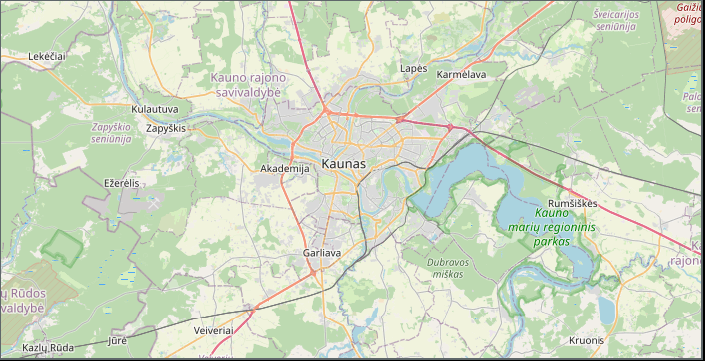

# Gio Maps

A Go implementation of map tiling using the [Gio UI toolkit](https://gioui.org/). This project serves as an educational example of how map tiling systems work and how to implement them in Go.



## Features

- Implements map tiling system from scratch
- Uses OpenStreetMap as the primary tile source
- Includes a local tile provider for development/fallback
- Supports smooth pan and zoom interactions
- Demonstrates coordinate conversion between different systems:
  - Latitude/Longitude
  - World coordinates
  - Tile coordinates
  - Screen coordinates

## Architecture

The project is structured around several key components:

- **Tile Providers**: Interface for fetching map tiles (OSM and Local implementations)
- **Tile Manager**: Handles tile caching and async loading
- **Coordinate Systems**: Utility functions for converting between different coordinate systems
- **Map View**: Main UI component handling rendering and user interaction

## Building and Running

```bash
go run apps/hello/main.go
```

## Technical Details

The project demonstrates several important concepts in map implementation:

1. **Tile System**: Maps are divided into tiles using the Slippy Map system, where:
   - Zoom levels determine detail (0-19)
   - X coordinates go from 0 (left edge) to 2^zoom - 1 (right edge)
   - Y coordinates go from 0 (top edge) to 2^zoom - 1 (bottom edge)

2. **Coordinate Conversions**: Implements conversions between:
   - Geographic coordinates (latitude/longitude)
   - World pixel coordinates
   - Tile coordinates
   - Screen coordinates

3. **Tile Loading**: Uses a combined provider approach:
   - Primary provider fetches from OpenStreetMap
   - Fallback provider generates local tiles
   - Asynchronous loading with caching

## Learning Resources

This project is useful for understanding:
- How map tiling systems work
- Coordinate system conversions
- UI interaction handling
- Asynchronous resource loading
- Caching strategies
- Go UI development with Gio

## TODO

- [ ] Smooth zoom animation when scrolling
- [ ] Animated transitions when moving to new coordinates
- [ ] Mobile support
  - [ ] Touch gestures for pan/zoom
  - [ ] Responsive layout
  - [ ] Mobile-friendly UI controls
  - [ ] Handle different screen densities

## License

MIT License
